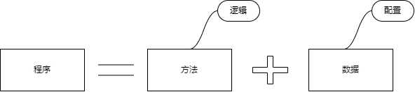
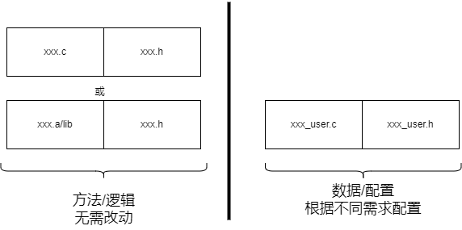
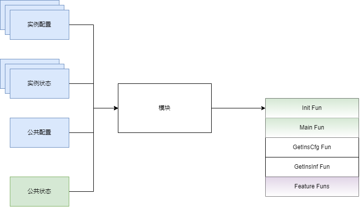
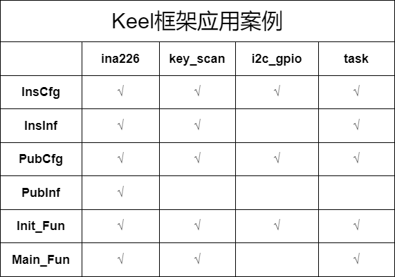

# module-code_template
    主仓：https://gitee.com/oldking-ecu
    镜像：https://github.com/oldking-ecu

#### 介绍

keel(发音[kiːl]剋欧)框架，一种通用的`模块化代码框架`  
▶ 支持`多实例`配置  
▶ 支持`配置`和`状态`分开(节省RAM资源)  
▶ 文件组织分`核心代码`(方法)和`配置代码`(数据)文件  
▶ 核心代码可以封装成.a/.lib，满足高内聚  
▶ 使用范围广，可以是`驱动`开发、`协议`开发、`中间件`等模块开发  

#### 软件架构
详情见B站[老王ECU软件开发](https://space.bilibili.com/522907272):  

程序组成  

文件组织  

特征抽象  

案例分析  

#### 使用说明

#### 1.配置
配置分为2部分 `每个实例的个性化配置`和`公共的配置`，具体可以参考如ina226、key_scan、i2c_gpio等模块。  

#### 2.使用
先调用Init，根据具体模块特征，可选的周期Main，以及一些`Feature Funcs`，具体可以参考如ina226、key_scan、i2c_gpio等模块。

#### 参与贡献

1.  Fork 本仓库
2.  新建 Feat_xxx 分支
3.  提交代码
4.  新建 Pull Request

#### 支持本项目

若这个项目帮到了你，不妨点个星标~，愿意的话也可以小额捐赠，感谢每一份认可~~

#### 捐赠者致谢

感谢以下朋友支持(按捐赠时间排序)
1. XXX
